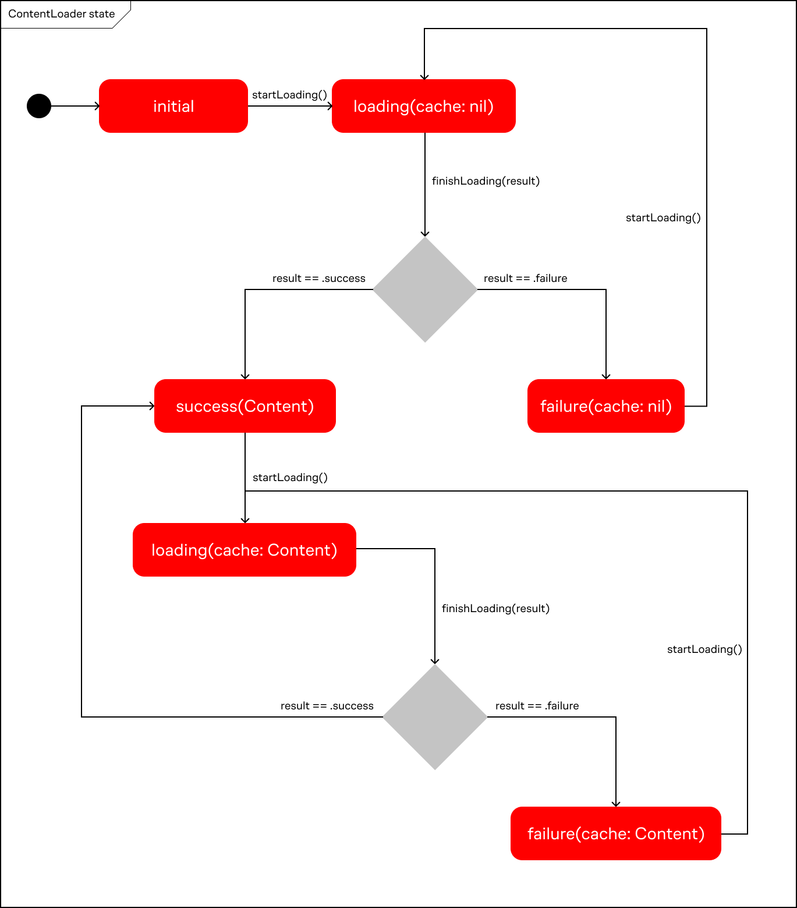

# ApexyLoader

ApexyLoader — дополнение для Apexy, которое позволяет хранить загруженные данные в памяти и следить за состоянием загрузки.

Основными понятиями ApexyLoader являются: загрузчик и состояние.

## Загрузчик

Загрузчик — объект который занимается загрузкой, хранением данных и уведомляет подписчиков об изменении состояния загрузки.

Загрузчик является наследником `WebLoader`. При наследовании от этого класса необходимо указать тип контента который должен быть таким же как и тип контента у `Endpoint`. Например `WebLoader<UserProfile>`.

В примере ниже показан загрузчик профиля пользователя.
`UserProfileEndpoint` возвращает `UserProfile` следовательно и `UserProfileLoader` тоже должен возвращать `UserProfile`.

```swift
import Foundation
import ApexyLoaders

protocol UserProfileLoading: ContentLoading {
    var state: LoadingState<UserProfile> { get }
}

final class UserProfileLoader: WebLoader<UserProfile>, UserProfileLoading {
    func load() {
        guard startLoading() else { return }
        request(UserProfileEndpoint())
    }
}
```

При создании загрузчика необходимо передать класс который реализует протокол `Client` из библиотеки Apexy.

Пример создания загрузчика используя паттерн Service Locator:

```swift
import Apexy
import ApexyURLSession
import Foundation

final class ServiceLayer {
    static let shared = ServiceLayer()
    private init() {}
    
    private(set) lazy var userProfileLoader: UserProfileLoading = UserProfileLoader(apiClient: apiClient)
    
    private lazy var apiClient: Client = {
        URLSessionClient(baseURL: URL(string: "https://api.server.com")!, configuration: .ephemeral)
    }()
}
```

Пример передачи зависимости в `UIViewController`.

```swift
final class ProfileViewController: UIViewController {

    private let profileLoader: UserProfileLoading
    
    init(profileLoader: UserProfileLoading = ServiceLayer.shared.userProfileLoader) {
        self.profileLoader = profileLoader
        super.init(nibName: nil, bundle: nil)
    }
}
```

## Состояния загрузки

За состояние загрузки отвечает `enum LoadingState<Content>`. У него могут быть следующие состояния:
- `initial` — начальное состояние, когда загрузка данных ещё не начата.
- `loading(cache: Content?)` — данные загружаются, при этом может быть закэшированный (ранее загруженный) конетнт.
- `success(content: Content)` — данные успешно загружены.
- `failure(error: Error, cache: Content?)` — ошибка загрузки данных, при этом может быть закэшированный (ранее загруженный) контент.

При создании загрузчика его начальное состояние будет `initial`. У загрузчика есть метод `startLoading()` который необходимо вызвать чтобы поменять состояние на `loading`. Сразу после первого вызова этого метода состояние загрузчика становится `loading(cache: nil)`. Если возникнет ошибка то состояние станет `failure(error: Error, cache: nil)`, иначе `success(Content)`. Если после успешной загрузки данных повторить загрузку данных (например при pull to refresh), то состояния `loading` и `failure` будут содеражать в аргументе `cache` ранее загруженные данные.



Состояния нескольких загрузчиков можно объединить с помощью метода `merge` у `LoadingState`. Этот метод принимает второе состояние и замыкание которое возвращает новый контент на основе контента обоих состояний.

В примере ниже есть два состояния: состояние загрузки информации о пользователе и состояние загрузки списка услуг. С помощью метода `merge` эти два состояния объединяются в одно. Вместо двух модельных объектов: `User` и `Service` будет один `UserServices`.

```swift
let userState = LoadingState<User>.loading(cache: nil)
let servicesState = LoadingState<[Service]>.success(content: 3)

let state = userState.merge(servicesState) { user, services in
    UserServices(user: user, services: services)
}

switch state {
case .initial:
    // initial state
case .loading(let userServices):
    // loading state with optional cache (info about user and list of services)
case .success(let userServices):
    // successfull state with info about user and list of services
case .failure(let error, let userServices):
    // failed state with optional cache (info about user and list of services)
}
```

## Отслеживание состояния загрузки

Чтобы следить за состоянием загрузчика используется метод `observe`. Как с RxSwift и Combine так и в случае ApexyLoader нужно сохранить ссылку на обсервер. Для этого нужно в свойствах класса объявить переменную типа `LoaderObservation`.

```swift
final class ProfileViewController: UIViewController {
    private var observer: LoaderObservation?
    ...
    override func viewDidLoad() {
        super.viewDidLoad()
        observer = userProfileLoader.observe { [weak self] in
            guard let self = self else { return }
            
            switch self.userProfileLoader.state {
            case .initial:
                //
            case .loading(let cache):
                //
            case .success(let content):
                //
            case .failure(let error, let cache):
                //
            }
        }
    }
}
```

## Сценарии использования

ApexyLoader применяется когда:
1. Необходимо хранить загруженные данные в памяти.
Например, чтобы при каждом заходе на экран не загружать данные заново, а использовать уже загруженные данные.
2. Процесс загрузки и сами загруженные данные отображаются на разных экранах.
Например, на одном экране может быть кнопка которая инициирует долгую операцию загрузки. После загрузки данных они могут отображаться на разных экранах. Сам процесс загрузки также может отображаться на разных экранах.
3. Необходимо загрузить данные из нескольких источников и показать процесс загрузки и результат как одно целое.

Пример:


В этом приложении на главном экране загружается больше кол-во данных из разных источников: список камер, домофонов, шлагбаумов, уведомления, профиль пользователя. Каждый загрузчик имеет своё состояние. Состояния всех загрузчиков можно объединить в одно состояние и показывать результат загрузки как одно целое.

Загрузчик списка камер переиспользуется на отдельном экране со списком камер. За счет этого, при переходе на экран со списком камер, можно сразу отобразить загруженные ранее данные. При этом, если на этом экране сделать pull-to-refresh, то список камер на главном экране тоже обновится.

## Example проект

Пример использования `ApexyLoader` смотри в папке `ApexyLoaderExample`.

Это приложение состоит из двух экранов. На первом экране можно начать загрузку данных, видеть индикацию загрузки и результат (список репозиториев и название организации). На втором экране можно видеть индикацию загрузки и тот же результат.

В этом примере демонстрируется шаринг загрузчика между экранами, отслеживание состояния загрузки и объединение состояний.


